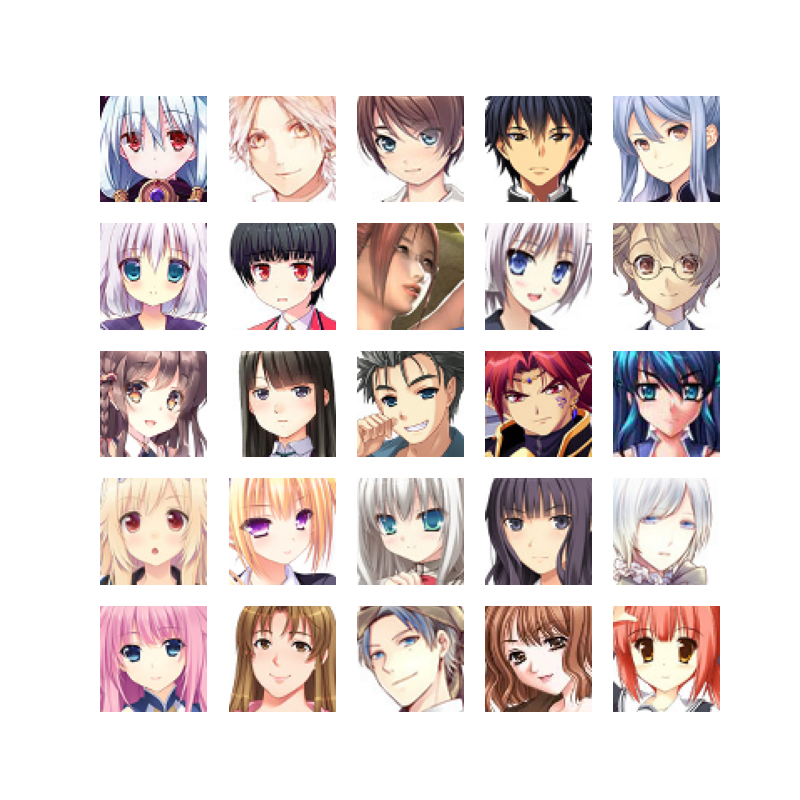
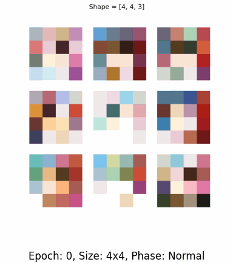
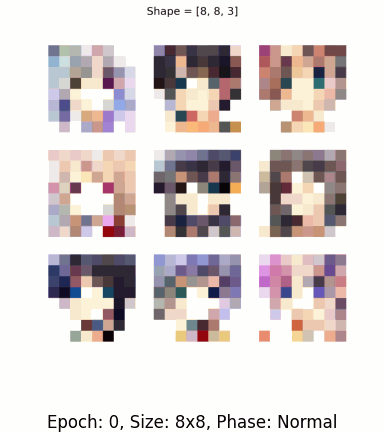
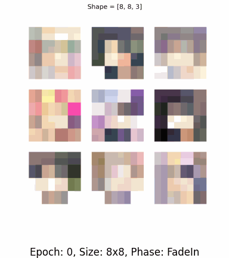
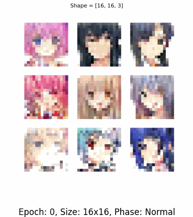
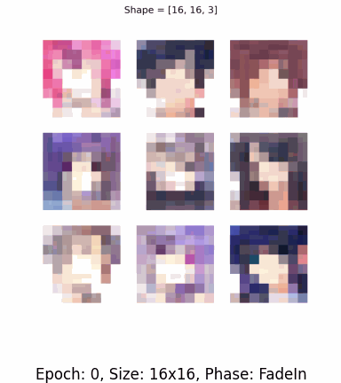
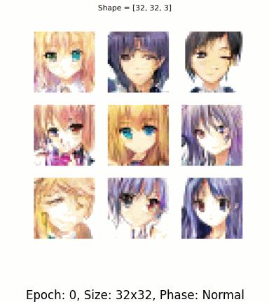
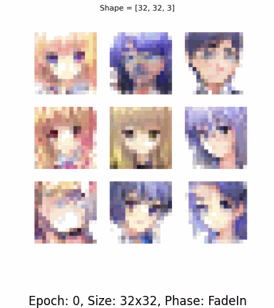

# ProGAN Anime Faces Generation

This project generates anime-style faces using a Progressive Growing GAN (ProGAN). The model gradually increases the resolution of generated images, starting from 4x4 up to 64x64 pixels.  

## Features
- Progressive training for smooth image generation from low to high resolution.
- Fully customizable hyperparameters for easy experimentation.
- Visualizations of training steps at each resolution.

## Getting Started

## Dependencies
This project requires the following major libraries:

- Python 3.x
- TensorFlow (2.16.1, includes Keras)
- NumPy
- Matplotlib
- Pillow
- TQDM

### Installation
1. Clone the repository:
   ```bash
   git clone https://github.com/sohamkhatod/AnimeFacesProGan.git
   cd AnimeFacesProGan
   ```
2. Install dependencies:
   ```bash
   pip install -r requirements.txt
   ```

### Usage
To customize hyperparameters, edit the parameters in the initial blocks of `main.py` (or the primary script):
```python
# Example hyperparameter block
learning_rate = 0.001
latent_dim = 256
batch_size = [5,5,5]
```


## Training

The code supports **distributed training** to enable efficient scaling for larger datasets and models. For faster training, I utilized **TPU** on Kaggle, which significantly accelerated the training process.

### Training Environment
- **Distributed Training**: The model can be trained across multiple devices.
- **TPU**: The model was trained using Kaggle's **TPU** for faster computation.

Feel free to adjust the training configuration based on your hardware setup.


## Dataset

This dataset contains **21,551 anime faces**, each of size **64x64 pixels**. The faces are sourced from Kaggle. 

You can find the dataset [here on Kaggle]([https://www.kaggle.com](https://www.kaggle.com/datasets/soumikrakshit/anime-faces)).

### Sample Image
Below is an example of an anime face from the dataset:



## Usage

The project includes a script (`evaluation.py`) to generate images from the trained weights located in the `/train` folder. You can modify the behavior of the script using the following command-line arguments.

### Command-Line Arguments

The `evaluation.py` script accepts several arguments that allow you to customize the number of images, plot size, and model file locations:

```bash
python evaluation.py [options]
```

#### Arguments:
- **`-n`, `--number-images`**: Specifies the number of images to display. Default is `1`.
- **`-s`, `--size`**: Specifies the size of the complete plot (grid). Default is `3`.
- **`-g`, `--Generator`**: Path to the trained **Generator** model. The file should be named `Generator.keras`. Default is `./Generator.keras`.
- **`-d`, `--Discriminator`**: Path to the trained **Discriminator** model. The file should be named `Discriminator.keras`. Default is `./Disciminator.keras`.
- **`--Display-disc`**: A flag to display the Discriminator score during evaluation. Default is `False`.
- **`--save`**: Name to save the file as .Example - final.png

### Example Usage:
```bash
ppython evaluation.py --save final.png -n 20 --size 8 --Generator ./train/Generator.keras --Discriminator ./train/Disciminator.keras --Display-disc True
```

This command will display 20 images in a 5x4 grid, using the trained **Generator** and **Discriminator** models from the `/train` folder, and show the Discriminator score.

### Outputs
The training process generates intermediate results for each resolution stage. Sample images and training GIFs are stored in the `outputs/` directory.

### Visualization
Below are sample GIFs showcasing training progress for each resolution:

- **4x4 Resolution**
  - Normal: 
  

- **8x8 Resolution**
  - Normal: 
  - FadeIn: 

- **16x16 Resolution**
  - Normal: 
  - FadeIn: 

- **32x32 Resolution**
  - Normal: 
  - FadeIn: 

- **64x64 Resolution**
  - Normal: 
  - FadeIn: 


## Final Generated Image

Below is a sample image generated by the trained model:


## References
1. Karras et al., *Progressive Growing of GANs for Improved Quality, Stability, and Variation*.
2. [ProGAN Guide on Paperspace Blog](https://blog.paperspace.com/progan/#developing-the-progan-model-architecture)
3. Dataset used: [Anime Faces Dataset](https://www.kaggle.com/datasets/soumikrakshit/anime-faces)
  
